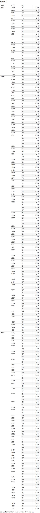

#Requirement 9
R Code and similar tableau where I partitioned the babies by race and order them by birthrate and then ranked them.

```{r}
source("../01 SQL Crosstabs/crosstab_9a.R", echo = TRUE)
```

      


#Requrements 12

#1st Requirement Rank()
```{r}
source("../01 SQL Crosstabs/crosstab_9a.R", echo = TRUE)
```
      

#2nd Requirement last_value/max_value and difference
```{r}
source("../01 SQL Crosstabs/crosstab_12_2.R", echo = TRUE)
```

      

  

#3rd Requirement nth_value
```{r}
source("../01 SQL Crosstabs/crosstab_12_3.R", echo = TRUE)
```

      

  
#4rd Requirement cume dist
```{r}
source("../01 SQL Crosstabs/9 LR.R", echo = TRUE)
```

  
